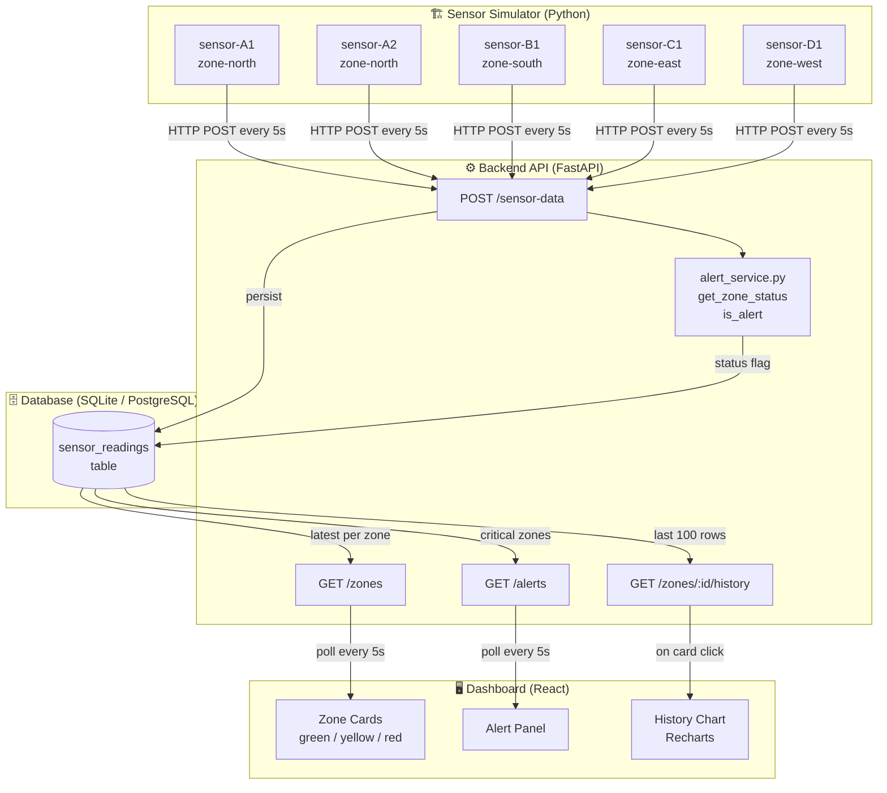
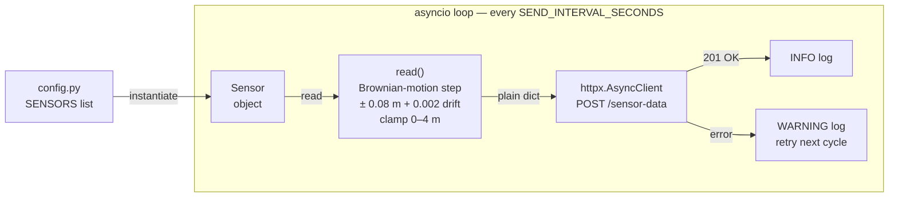
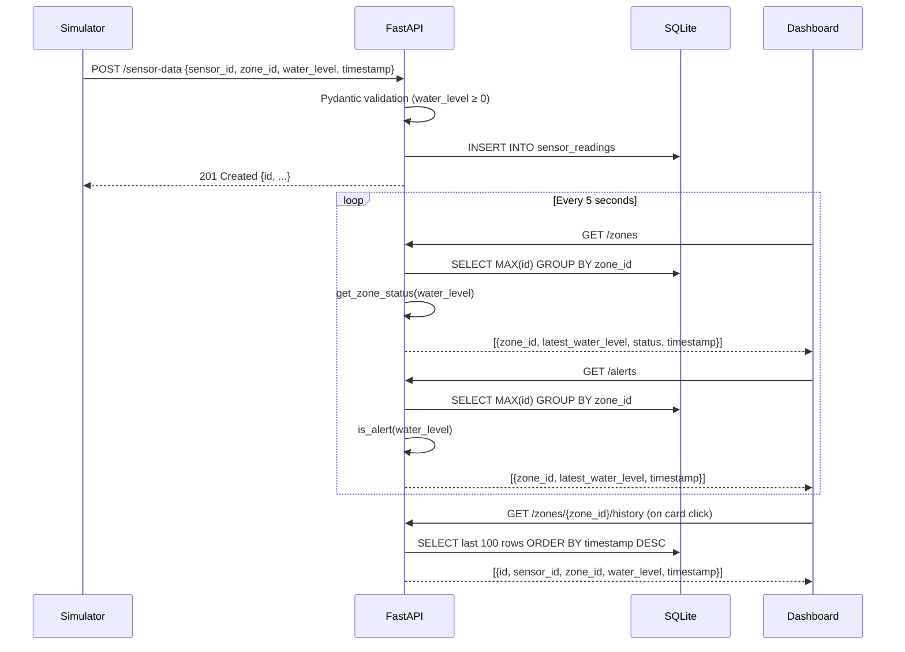
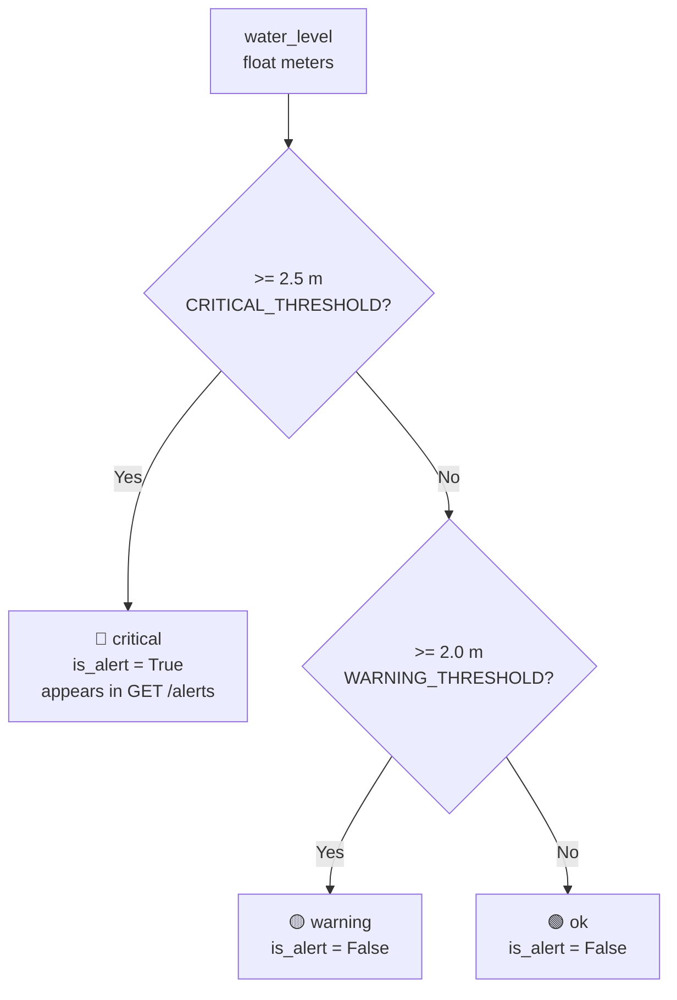
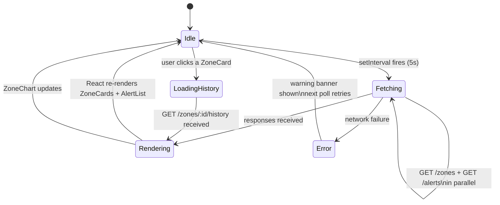
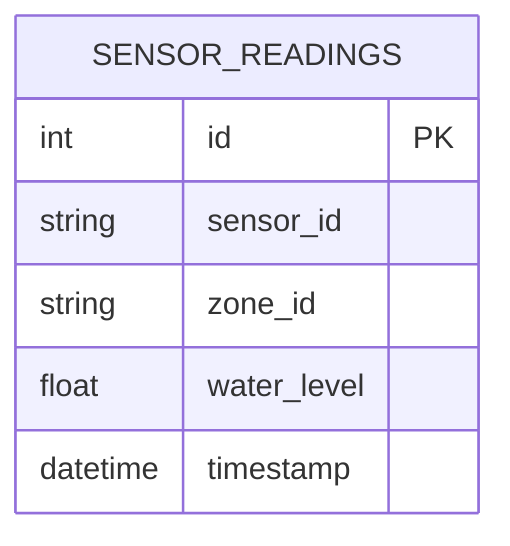
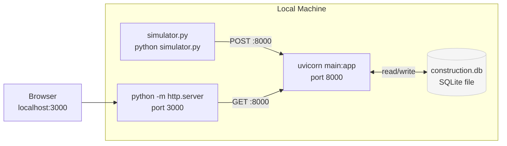

# SiteSense — System Architecture & Data Flow

> Diagrams render natively on GitHub. All Mermaid blocks below are self-contained.

---

## 1. High-Level System Overview

---

## 2. Sensor Simulator — Internal Flow

---

## 3. Backend API — Request Lifecycle

---

## 4. Alert Logic — Status Classification

---

## 5. Frontend Polling Cycle

---

## 6. Database Schema

> Single flat table for MVP simplicity.
> Query pattern: `SELECT MAX(id) … GROUP BY zone_id` to get the latest reading per zone without N+1.

---

## 7. Deployment Overview

> **To switch to PostgreSQL:** set `DATABASE_URL=postgresql://user:pw@host/db`
> before starting the backend — no code changes required.
